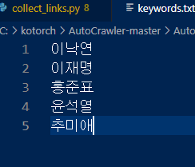
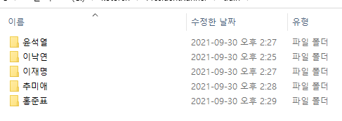
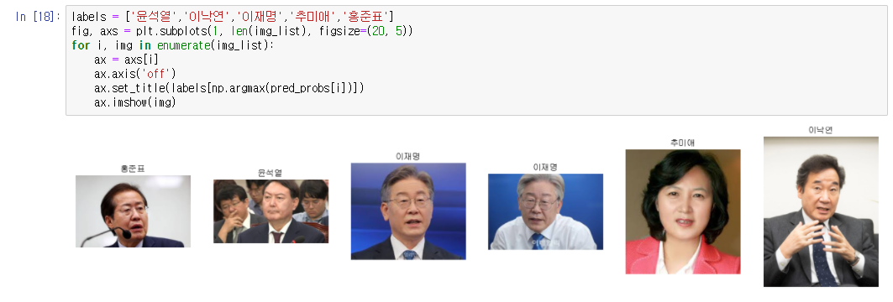

# Resnet 을 사용한 이미지 분류 학습

딥러닝에서 CNN은 이미지 인식 분야에서 뛰어난 성능을 보여주고 있습니다. CNN 네트워크의 층(layer)을 더 쌓으며 아주 깊은 네트워크를 구현하여 성능 향상을 이룰 수 있습니다. 
하지만 실제로 어느정도 이상 깊어진 네트워크는 오히려 vanishing/exploding gradient 문제 때문에 성능이 더 떨어졌는데 이러한 현상을 degradation problem이라고 합니다. 
문제가 발생하는 이유는 weight들의 분포가 균등하지 않고, 역전파가 제대로 이루어지지 않기 때문입니다. ResNet은 이러한 neural network의 구조가 깊어질수록 정확도가 감소하는 문제를 해결하기 위해 제안되었습니다.

ResNet은 2015 년 Microsoft Research Asia의 He Kaiming, Sun Jian 등이 제안한 네트워크 구조로 ILSVRC-2015 분류 과제 에서 1 위를 차지했습니다. 동시에 ImageNet 감지, ImageNet 현지화, COCO 감지 및 COCO 분할 작업에서 1 위를 차지했습니다.

ResNet의 original 논문명은 "Deep Residual Learning for Image Recognition"이고, 저자는 Kaiming He, Xiangyu Zhang, Shaoqing Ren, Jiao Sun으로 전부 다 중국인입니다. 
2014년의 GoogLeNet이 22개 층으로 구성된 것에 비해, ResNet은 152개 층을 갖는다. 약 7배나 깊어졌습니다.  

ResNet은 연결 건너 뛰기 또는 잔여 블록을 사용하여 특정 계층을 건너 뛰어 더 깊은 네트워크에서 최적화 / 저하 문제를 해결하여 깊이를 높이는 데 성공했으며 대신 모델의 성능에 해를 끼치 지 않고 성능이 향상되었습니다.

이제 RESNET 구조를 사용하여 전이학습으로 2022년 대선 후보들의 얼굴을 인식/분류하는 학습을 테스트해 보겠습니다.

##  대선후보 얼굴 사진 크롤링

일단 대선후보들의  멤버들의 사진을 모아야 합니다. 웹크롤러는 깃허브 오픈소스 프로젝트인 AutoCrawler를 사용했습니다.
( https://github.com/YoongiKim/AutoCrawler ) 참고하세요
( https://www.opensourceagenda.com/projects/autocrawler )

먼저 
1. 다음 링크 파이썬 소스를 다운로드한다 https://github.com/YoongiKim/AutoCrawler 
2. keywords.txt에 내가 크롤링하고 싶은 검색어를 한 줄에 한 개씩 쓴다.
3. 터미널 창에서 python main.py 를 실행한다.
4. 자동으로 크롬이 실행되며 selenium 으로 이미지를 폴더별로 다운로드 합니다.
5. 프로그램이 종료 할때 까지 기다리시면 됩니다.

1000개 이상의 많은 이미지가 다운로드 되었습니다. 
학습의 정확도를 위해 여러 명이 나온 사진들과 같은 부적합한 이미지들을 삭제해 줍니다.
대선 후보 사진들을 크롤링해서 모으는 것보다 부적합한 사진들을 지우는데 더 오랜 시간이 걸렸습니다. 역시 양질의 데이터가 중요합니다.

## RESNET 을 이용한 이미지 분류 전이학습 및 테스트

이제는 pyTorch에서 RESNET을 사용해서 전이학습하는 소스를 만들어 봅니다.
아래 쏘스는 다음 싸이트를 참고 했습니다.   ( https://www.kaggle.com/pmigdal/transfer-learning-with-resnet-50-in-pytorch )

* 먼저 pytorch 딥러닝 학습에 필요한 여러가지 라이브러리를 import 합니다.
특히 torchvision의 models 를 import 하여 resnet50 모델을 사용할수 있도록 해야 합니다.

~~~python
import numpy as np
%matplotlib inline
import matplotlib.pyplot as plt
from PIL import Image
import torch
from torchvision import datasets, models, transforms
import torch.nn as nn
from torch.nn import functional as F
import torch.optim as optim
~~~

* GPU가 있으면 GPU로 학습 하도록 설정 합니다.
~~~python
device = torch.device("cuda" if torch.cuda.is_available() else "cpu")
~~~

* resnet50 모델을 가져 옵니다. pretrained는 ImageNet 으로 사전 학습된 모델을 가져 올지를 결정하는 파라메터 입니다.
우리는 True 를 설정합니다.

또한 미리 학습된 모델로 finetuning 하는 것이므로 requires_grad = False 로 설정 해 주어야 학습이 안되도록 고정시킬 수 있다.
불러온 모델의 마지막 fc (fully connected) layer 를 수정하여 fc layer를 원하는 layer로 변경한다.
우리는 출력이 5명으로 분류하는 모델을 만들 것이므로 nn.Linear(128, 5) 를 사용한다.
~~~python
model = models.resnet50(pretrained=True).to(device)
    
for param in model.parameters():
    param.requires_grad = False   
    
model.fc = nn.Sequential(
               nn.Linear(2048, 128),
               nn.ReLU(inplace=True),
               nn.Linear(128, 5)).to(device)
~~~

* 크롤링한 대선 후보 사진들을 Resnet 의 입력에 적합하도록 transform 하는 함수를 만듭니다. Resnet 의 이비지 싸이즈는 224*224 입니다.
    - transforms.RandomAffine(degrees) - 랜덤으로 affine 변형을 한다.
    - transforms.RandomHorizontalFlip() - 이미지를 랜덤으로 수평으로 뒤집는다.
    - transforms.ToTensor() - 이미지 데이터를 tensor로 바꿔준다.
    - transforms.Normalize(mean, std, inplace=False) - 이미지를 정규화한다.
~~~python
normalize = transforms.Normalize(mean=[0.485, 0.456, 0.406],
                                 std=[0.229, 0.224, 0.225])

data_transforms = {
    'train':
    transforms.Compose([
        transforms.Resize((224,224)),
        transforms.RandomAffine(0, shear=10, scale=(0.8,1.2)),
        transforms.RandomHorizontalFlip(),
        transforms.ToTensor(),
        normalize
    ]),
    'validation':
    transforms.Compose([
        transforms.Resize((224,224)),
        transforms.ToTensor(),
        normalize
    ]),
}
~~~

* DataLoader를 사용하여 이미지들을 읽습니다. 물론 해당 경로에 1000 여장의 사진들이 각각 있어야 합니다.
~~~python
image_datasets = {
    'train': datasets.ImageFolder(input_path + 'train', data_transforms['train']),
    'validation': datasets.ImageFolder(input_path + 'validation', data_transforms['validation'])
}
dataloaders = {
    'train': torch.utils.data.DataLoader(image_datasets['train'],
                                batch_size=32,
                                shuffle=True,
                                num_workers=0),  # for Kaggle
    'validation': torch.utils.data.DataLoader(image_datasets['validation'],
                                batch_size=32,
                                shuffle=False,
                                num_workers=0)  # for Kaggle
}
~~~

* 손실 함수는 CrossEntropyLoss, 옵티마이저는 Adam 을 사용 하도록 설정 합니다.
~~~python
criterion = nn.CrossEntropyLoss()
optimizer = optim.Adam(model.fc.parameters())
~~~

* 이미지를 학습하는 함수를 작성합니다. 일반적인 pyTorch 학습 코드와 동일합니다.
~~~python
def train_model(model, criterion, optimizer, num_epochs=3):
    for epoch in range(num_epochs):
        print('Epoch {}/{}'.format(epoch+1, num_epochs))
        print('-' * 10)

        for phase in ['train', 'validation']:
            if phase == 'train':
                model.train()
            else:
                model.eval()

            running_loss = 0.0
            running_corrects = 0

            for inputs, labels in dataloaders[phase]:
                inputs = inputs.to(device)
                labels = labels.to(device)

                outputs = model(inputs)
                loss = criterion(outputs, labels)

                if phase == 'train':
                    optimizer.zero_grad()
                    loss.backward()
                    optimizer.step()

                _, preds = torch.max(outputs, 1)
                running_loss += loss.item() * inputs.size(0)
                running_corrects += torch.sum(preds == labels.data)

            epoch_loss = running_loss / len(image_datasets[phase])
            epoch_acc = running_corrects.double() / len(image_datasets[phase])

            print('{} loss: {:.4f}, acc: {:.4f}'.format(phase,
                                                        epoch_loss,
                                                        epoch_acc))
    return model
~~~

* 모델을 학습합니다. 시간이 좀 걸립니다.
~~~python
torch.save(model_trained.state_dict(), './pweights.h5')
~~~

* 학습이 완료된 모델을 저장 합니다.
~~~python
device = torch.device("cuda" if torch.cuda.is_available() else "cpu")
~~~

* 모델을 다시 만듭니다. 이번에는 학습을 하지 않고 저장된 weight 만 load 할 것이기 때문에 pretrained를 False 로 설정합니다.
그후 위에서 학습한 weight 값을 읽어 모델을 준비 합니다.
~~~python
model = models.resnet50(pretrained=False).to(device)
model.fc = nn.Sequential(
               nn.Linear(2048, 128),
               nn.ReLU(inplace=True),
               nn.Linear(128, 5)).to(device)
model.load_state_dict(torch.load('./pweights.h5'))
~~~

* 테스트할 이미지를 준비합니다.
~~~python
validation_img_paths = ["test/google_0002.jpg",
                        "test/google_0012.jpg",
                        "test/google_0013.jpg",
                        "test/google_0040.jpg",
                        "test/google_0017.jpg",
                        "test/naver_0050.jpg",
                       ]
img_list = [Image.open(input_path + img_path) for img_path in validation_img_paths]
~~~

* 이미지를 Resnet50에 적합한 입력으로 만들기 위해 transform 합니다..
~~~python
validation_batch = torch.stack([data_transforms['validation'](img).to(device) for img in img_list])
~~~

* 학습된 모델로 테스트 이미지를 예측합니다. 예측된 결과는 Softmax 를 사용하여 어떤 이미지로 분류 되는지 확률을 보여 줍니다.
~~~python
pred_logits_tensor = model(validation_batch)
pred_probs = F.softmax(pred_logits_tensor, dim=1).cpu().data.numpy()
~~~

* matplotlib 에서 한글이 깨지는 것을 방지하기 위한 처리를 합니다.
~~~python
from matplotlib import font_manager, rc
font_path = "C:/Windows/Fonts/NGULIM.TTF"
font = font_manager.FontProperties(fname=font_path).get_name()
rc('font', family=font)
~~~

* 테스트 사진이 어떤 사람의 사진인지 화면에 출력 해 봅니다. argmax 함수를 통해 가장 확률이 높은 사람의 인덱스를 구해서 해당 이미지와 이름을 출력합니다.
~~~python
labels = ['윤석열','이낙연','이재명','추미애','홍준표']
fig, axs = plt.subplots(1, len(img_list), figsize=(20, 5))
for i, img in enumerate(img_list):
    ax = axs[i]
    ax.axis('off')
    ax.set_title(labels[np.argmax(pred_probs[i])])
    ax.imshow(img)
~~~

* 테스트 이미지를 학습된 모델로 분류 해봅니다.
아주 잘 작동합니다.
